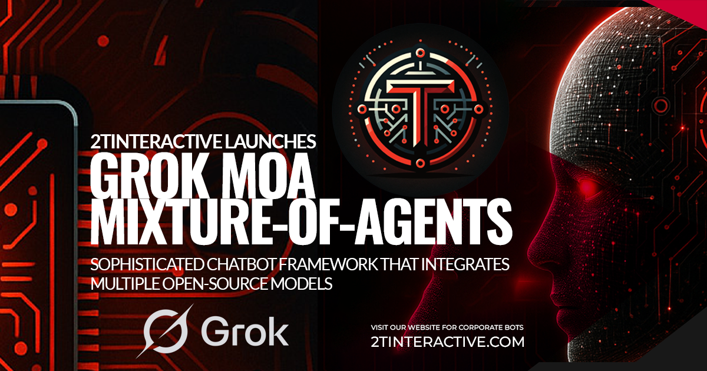

# MoA Chatbot - Mixture of Agents

A modern, feature-rich AI chatbot web application built with Flask, featuring multiple model support, document analysis, and a beautiful dark-themed UI with light/dark mode switching.

[](https://github.com/LebToki/MoA)
[](https://github.com/LebToki/MoA/blob/main/LICENSE)
[](https://github.com/LebToki/MoA/actions)
[](https://your-docs-site.com)
[](https://www.npmjs.com/package/your-package-name)
[](https://python.org)
[](https://developer.mozilla.org/en-US/docs/Web/JavaScript)
[]()




## Features

- 🤖 **Multiple AI Models**: Support for Llama 3.1, Mixtral, Gemma, Qwen, and DeepSeek models
- 📄 **Document Analysis**: Upload and analyze PDF, DOCX, and TXT files
- 🎨 **Modern UI/UX**: Beautiful dark theme with glassmorphism effects and light/dark mode toggle
- 💬 **Conversation Management**: Create, organize, and manage multiple conversation topics
- ⚙️ **Customizable Parameters**: Adjust temperature, max tokens, and model selection
- 📱 **Responsive Design**: Works seamlessly on desktop, tablet, and mobile devices
- 🔒 **Secure**: Environment-based configuration and secure file handling
- 📊 **Logging**: Comprehensive logging system for debugging and monitoring
- 🎯 **Branding**: Fully customizable branding with company logos and information

---

## screenshots


---

## Installation

### 1. Clone the Repository

```sh
git clone https://github.com/LebToki/MoA.git
cd MoA
```

### 2. Install Dependencies

**Windows:**
```powershell
pip install -r requirements.txt
```

**Linux/Mac:**
```sh
pip install -r requirements.txt
```

**Note for Windows users:** The requirements.txt has been updated to use a newer version of PyMuPDF (pymupdf>=1.26.0) that includes pre-built wheels for Windows, ensuring easier installation without requiring build tools.

#### List of Dependencies

- **openai**: OpenAI API client library
- **fire**: A Python library for creating command line interfaces
- **loguru**: A library to make logging in Python simpler and more readable
- **datasets**: Hugging Face's library for accessing and managing datasets
- **typer**: A library for building command line interface applications
- **rich**: A Python library for rich text and beautiful formatting in the terminal
- **Flask**: A micro web framework for Python
- **Flask-SQLAlchemy**: Adds SQLAlchemy support to Flask applications
- **Flask-Uploads**: A flexible library to handle file uploading in Flask
- **Werkzeug**: A comprehensive WSGI web application library
- **Flask-Migrate**: Handles SQLAlchemy database migrations for Flask applications using Alembic
- **PyMuPDF (fitz)**: A Python binding for MuPDF – a lightweight PDF and XPS viewer
- **python-docx**: A Python library for creating and updating Microsoft Word (.docx) files

### 3. Set Up Environment Variables

Create a `.env` file in the root directory and add your API keys and branding:

```env
# API Keys
GROQ_API_KEY=your_groq_api_key
OPENAI_API_KEY=your_openai_api_key
DEBUG=0

# Branding (optional - customize to match your brand)
DEVELOPER_NAME=Your Name
COMPANY_NAME=Your Company Name
COMPANY_URL=https://yourcompany.com
GITHUB_USERNAME=your-github-username
GITHUB_REPO=MoA
APP_NAME=MoA Chatbot
APP_DESCRIPTION=Mixture of Agents
COMPANY_LOGO=your-logo.png
```

**Note:** You can copy `.env.example` to `.env` and update the values. See `BRANDING.md` for detailed branding configuration instructions.

## Running the Application

**Windows:**

You can run the application using either:

- **Batch file (recommended):** Double-click `run.bat` or run it from Command Prompt
- **PowerShell script:** Right-click `run.ps1` and select "Run with PowerShell" or run:
  ```powershell
  .\run.ps1
  ```
- **Direct Python command:**
  ```powershell
  python app.py
  ```

**Linux/Mac:**
```sh
python app.py
```

Then open your web browser and navigate to:
```
http://127.0.0.1:5000/
```

## Viewing Logs

The application logs are stored in the `logs/` directory:

- **Log file location:** `logs/moa_app.log`
- **Log rotation:** Logs are automatically rotated when they reach 10MB (keeps last 10 files)

**Windows:**
- **Batch file:** Double-click `view_logs.bat` to view the latest log entries
- **PowerShell:** Run `.\view_logs.ps1` for a colored log viewer
- **Manual:** Open `logs\moa_app.log` in any text editor

**Linux/Mac:**
```sh
tail -f logs/moa_app.log  # View live logs
tail -n 50 logs/moa_app.log  # View last 50 lines
```

Logs include:
- Application startup/shutdown events
- Error messages and stack traces
- File upload processing
- API request errors
- Database operations

## Usage

### Interacting with the MoA Chatbot

- **Model Selection**: Choose the model you want to use from the dropdown menu. The default model is `llama3-70b-8192`, which balances performance and speed.

- **Temperature Control**: Adjust the temperature setting to control the randomness and creativity of the chatbot's responses. The default value is `0.7`, providing a good balance between deterministic and varied outputs.

- **Max Tokens**: Define the maximum number of tokens (words or characters) for the response. The default is `2048`, which ensures comprehensive answers without overwhelming verbosity.

- **Create Your Topics**: Easily create new conversation topics by entering your desired topic names in the text field provided. This helps organize your interactions and revisit previous conversations.

- **Choose Your Topic**: Select a topic by clicking on it in the sidebar. The chat interface will load on the right, allowing you to continue your discussion seamlessly.

- **Instruction Input**: Enter your prompt or instruction in the text area. This is where you ask questions or provide commands to the chatbot.

- **Theme Toggle**: Enhance your user experience by switching between light and dark modes using the theme toggle switch in the sidebar.

- **Submit and View Responses**: After filling in the necessary fields, submit the form to receive a response from the MoA Chatbot. The response will be displayed on the same page, within the chat interface.

### Additional Features

- **Create New Conversations**: Use the sidebar to create new conversation topics, helping you manage different discussions effectively.

- **Reset All Conversations**: If needed, reset all conversations from the sidebar to start fresh.

- **Document Upload**: Upload PDF, DOCX, or TXT files to analyze their content within the chatbot conversation.

This intuitive interface makes it easy to engage with the MoA Chatbot, providing a seamless and interactive user experience.

## Branding Configuration

**Important**: This software is licensed with branding protection. The original branding (Tarek Tarabichi and 2TInteractive) **MUST be retained** as required by the license. You may add your own branding alongside it, but you cannot remove or replace it.

### Required Branding (Always Shown)

The following branding is **always displayed** and cannot be removed:
- **Developer**: Tarek Tarabichi
- **Company**: 2TInteractive
- **GitHub**: LebToki/MoA

### Adding Your Own Branding

You can add your own branding **alongside** the required branding:

1. Copy `.env.example` to `.env`
2. Add your custom branding (optional):
   ```env
   # Custom Branding (Added alongside required branding)
   CUSTOM_DEVELOPER_NAME=Your Name
   CUSTOM_COMPANY_NAME=Your Company Name
   CUSTOM_COMPANY_URL=https://yourcompany.com
   CUSTOM_COMPANY_LOGO=your-logo.png
   
   # Application Configuration
   APP_NAME=MoA Chatbot
   APP_DESCRIPTION=Mixture of Agents
   ```
3. Place your custom logo in `static/images/` (if using)
4. Add your OG banner (1200x630px) to `static/images/og_banner.png`

**See `BRANDING.md` for detailed instructions and examples.**

## Planned Features

- **Streaming Responses**: Real-time streaming of AI responses for better UX
- **Export Conversations**: Export chat history as PDF or text files
- **Search Functionality**: Search through conversation history
- **Advanced Settings**: More customization options for model parameters
- **Multi-language Support**: Support for multiple languages
- **API Endpoints**: RESTful API for integration with other applications

## File Structure

```
MoA/
├── app.py                 # Flask application main file
├── bot.py                 # Main chatbot logic
├── utils.py               # Utility functions
├── config.py              # Branding and configuration
├── requirements.txt       # Python dependencies
├── .env.example          # Environment variables template
├── run.bat               # Windows batch script to run app
├── run.ps1               # Windows PowerShell script to run app
├── view_logs.bat          # Windows script to view logs
├── view_logs.ps1          # Windows PowerShell script to view logs
├── templates/
│   ├── index.html         # Home page template
│   └── chat.html          # Chat interface template
├── static/
│   ├── style.css          # Modern CSS styles
│   ├── script.js           # JavaScript for UI interactions
│   ├── bot.png            # Favicon
│   └── images/
│       ├── og_banner.png  # Open Graph banner (1200x630px)
│       └── [your-logo]    # Company logo
├── instance/              # Database directory (auto-created)
│   └── conversations.db  # SQLite database
├── logs/                  # Log files directory (auto-created)
│   └── moa_app.log        # Application log file
└── uploads/               # Uploaded documents (auto-created)
```

**Note**: The `instance/`, `logs/`, and `uploads/` directories are automatically created when you run the application.

## Changelog

### Version 2.0.1 · [November, 20th 2025]

**Major Release - Complete UI Overhaul & Branding System**

#### 🎨 UI/UX Enhancements
* **NEW**: Complete UI redesign with modern dark theme and glassmorphism effects
* **NEW**: Light/Dark theme toggle switch with smooth transitions
* **IMPROVED**: Responsive sidebar with compact, modern design
* **IMPROVED**: Enhanced chat interface with better message bubbles and spacing
* **NEW**: Fixed footer with branding information and social links
* **IMPROVED**: Modern typography using Inter font family

#### 🎯 Branding System
* **NEW**: Full branding support with customizable app name, company name, and developer info
* **NEW**: Dynamic branding configuration via `.env` file
* **NEW**: Company logo integration in sidebar and footer
* **NEW**: Complete Open Graph and Twitter Card support for social sharing
* **NEW**: OG banner support (1200x630px) for social media previews

#### 🔧 Technical Improvements
* **NEW**: Full Windows compatibility with batch and PowerShell scripts
* **NEW**: Comprehensive file-based logging system with rotation
* **IMPROVED**: SQLite database handling for Windows with proper path management
* **NEW**: Iconify integration for modern icon support
* **IMPROVED**: CDN optimization with reliable sources (jsDelivr)

#### 📱 Features
* **NEW**: Theme persistence using localStorage
* **IMPROVED**: Auto-scroll to latest messages
* **IMPROVED**: Auto-resizing textarea for better form handling
* **IMPROVED**: Enhanced document upload with better error handling
* **IMPROVED**: Better conversation list organization

#### 🐛 Bug Fixes
* **FIXED**: Database path issues on Windows
* **FIXED**: Iconify CDN loading issues
* **FIXED**: Footer positioning and overlap issues
* **FIXED**: Icon rendering across all browsers

#### 📚 Documentation
* **IMPROVED**: Updated README with comprehensive installation and usage instructions
* **NEW**: Added branding configuration guide
* **IMPROVED**: Windows-specific documentation
* **NEW**: Added logging documentation

---

### Version 1.1.0 · [02/07/2024]

* **NEW**: Implemented Dark Mode Support - Switch between light and dark themes for better usability
* **IMPROVED**: Enhanced UI/UX - Updated the styling of the chat interface, including better message formatting and improved layout
* **IMPROVED**: Improved Form Layout - Grouped form inputs on a single row for better space utilization
* **IMPROVED**: Sidebar Adjustment - Reduced the sidebar width to 180px to provide more space for the main chat interface
* **NEW**: Document Upload Support - Added the ability to upload documents and interact with the content within the chatbot
* **IMPROVED**: Improved Sorting - Ensured conversation messages are displayed in descending order to prioritize the most recent interactions

<details>
<summary>Previous Releases</summary>

### Initial Release · [01/07/2024]

* **NEW**: Code Organization - Initial setup of the project with organized structure for controllers, models, and views
* **NEW**: Error Handling - Basic error handling for API requests and user inputs
* **NEW**: Front-end Enhancements - Initial design of the UI with Bootstrap and FontAwesome integration. Responsive design for better accessibility on all devices
* **NEW**: Performance Considerations - Basic optimizations for faster loading times
* **NEW**: Accessibility and Usability - Added alt attributes to all images for better accessibility

</details>

## Acknowledgements

* **Original Creator**: Special thanks to the original creator of this amazing project. [togethercomputer](https://github.com/togethercomputer/MoA)
* **Matthew Berman**: A special thanks to [Matthew Berman](https://www.youtube.com/@matthew_berman) for showcasing this project and providing valuable insights.

## License

This project is licensed under a **Custom Open Source License with Branding Protection**.

**Key Points:**
- ✅ **Free to use, modify, and distribute**
- ✅ **Open source and community-friendly**
- ✅ **Requires attribution** - Branding for Tarek Tarabichi and 2TInteractive must be retained
- ✅ **Community contributions** - All feedback via GitHub Issues (not Discussions) for community benefit
- ✅ **Commercial use allowed** - You can use this in commercial projects

**Full License Text:** See [LICENSE](LICENSE) file for complete terms and conditions.

**Important:** When using, modifying, or distributing this software, you MUST retain the branding attributions to Tarek Tarabichi and 2TInteractive in:
- README files
- Documentation
- User interfaces
- Footer credits
- About sections

You may add your own branding alongside the required attributions, but you may NOT remove or obscure the original branding.

For commercial licensing options or questions, please contact: https://2tinteractive.com

## Contributing

We welcome contributions! Please read the [CONTRIBUTING](CONTRIBUTING.md) guidelines before submitting a pull request.

### How to Contribute

1. **Report Issues**: Found a bug or have a feature request? Open a [GitHub Issue](https://github.com/LebToki/MoA/issues) so the whole community can benefit from the discussion.

2. **Submit Pull Requests**: Fork the repository, make your changes, and submit a pull request. Please ensure:
   - Your code follows the existing style
   - You've tested your changes
   - You've updated documentation if needed
   - Branding attributions are preserved

3. **Community Benefit**: All contributions, discussions, and feedback should go through GitHub Issues (not Discussions) to ensure maximum community visibility and benefit.

### Note for Contributors

This project is based on Groq's API, not the original Together API. If you are contributing, please ensure compatibility and optimizations are aligned with Groq's specifications and guidelines.

**Branding Requirement**: When contributing, please maintain the branding attributions to Tarek Tarabichi and 2TInteractive as required by the license.

## Contact

For any questions or feedback, please open an issue in this repository.

---

## 💼 Professional Services & Premium Solutions

### 🚀 2TInteractive - Your Development Partner

Looking for **custom development**, **premium solutions**, or **professional services**?

**2TInteractive** offers:

* **Custom Web Development** - Tailored solutions for your business needs
* **AI Chatbot Solutions** - Enterprise-grade chatbot development and customization
* **MoA Chatbot Customization** - Custom features, integrations, and modifications
* **Full-Stack Development** - Modern web applications with cutting-edge technologies
* **Consulting Services** - Expert guidance for your AI and development projects
* **Maintenance & Support** - Ongoing support and updates for your applications

**Visit us**: <https://2tinteractive.com>

**Contact**: For inquiries about premium solutions, custom development, or professional services, please visit our website or reach out through our contact channels.

---

_This chatbot is open-source and free to use. For enterprise features, custom integrations, or professional support, consider our premium services._

---

**Made with ❤️ for the AI and development community**

**Author**: Tarek Tarabichi | **Company**: 2TInteractive | **Website**: <https://2tinteractive.com>

---

## Get Involved

Whether you're a developer, system integrator, or enterprise user, you can trust that we did everything possible to make it as smooth and easy as 1,2,3 to set up MoA Chatbot.

⭐ **Give us a star on GitHub** 👆

⭐ **Fork the project on GitHub and contribute** 👆

🚀 **Do you like to code?** You're more than welcome to contribute! Open an Issue to share your ideas!

💡 **Got a feature suggestion?** Add your roadmap ideas

---

Thank you for using MoA Chatbot!

We hope you find it useful and look forward to your contributions.
